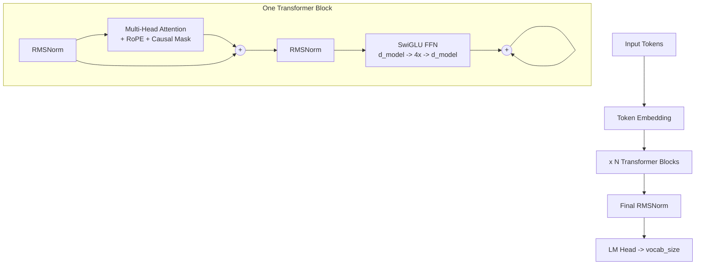

This page brings together everything you need to look up quickly: what each term means, how the model is structured internally, and exactly where each of the 124 million parameters lives. Bookmark it as your companion while working through the chapters.

## Architecture diagram

The diagram below shows one full forward pass through the model. Tokens enter as integers, get projected into 768-dimensional vectors, pass through 12 identical Transformer blocks, and are projected back out to vocabulary logits.



## Parameter count breakdown

The 124M parameter count is exact, not approximate. Here is where every single parameter lives in the 124M model (GPT-2 Small equivalent).

```text
Token Embedding:  vocab_size x d_model = 50,257 x 768 = 38,597,376

Per Transformer Block (12 total):
  Attention QKV:   3 x 768 x 768 = 1,769,472
  Attention Out:   768 x 768     =   589,824
  SwiGLU w1:       768 x 3072    = 2,359,296
  SwiGLU w2:       768 x 3072    = 2,359,296
  SwiGLU w3:       3072 x 768    = 2,359,296
  RMSNorm x2:      768 + 768     =     1,536
  Total/block:                   = 9,438,720

12 blocks:  12 x 9,438,720      = 113,264,640

Final RMSNorm:                   =       768
LM Head: shared with embedding   =         0  (weight tying!)

Grand Total: 38,597,376 + 113,264,640 + 768 = 124,439,808
```

<Note>
  The LM Head contributes zero extra parameters because its weight matrix is shared with the token embedding via **weight tying**. The same 38.6 M values that map token IDs to vectors also map the final hidden state back to vocabulary logits.
</Note>

## Glossary

The terms below appear throughout the chapters. They are listed alphabetically so you can look up any unfamiliar word without reading linearly.

<AccordionGroup>
  <Accordion title="AdamW">
    A variant of the Adam optimizer that applies **decoupled weight decay** — the regularization penalty is subtracted directly from the weights rather than being folded into the gradient update. This separation means weight decay actually acts as regularization instead of being absorbed by Adam's per-parameter learning rates. AdamW is the standard optimizer for all modern LLMs, including GPT-3 and LLaMA.
  </Accordion>

  <Accordion title="Attention">
    The mechanism that lets every token look at every other token (within the causal mask) and decide how much information to borrow from each. Concretely, each token computes a Query vector and compares it against the Key vectors of all previous tokens; the dot-product scores are softmaxed into weights, and those weights sum the Value vectors. The result for each position is a context-aware blend of the sequence so far.
  </Accordion>

  <Accordion title="BPE (Byte Pair Encoding)">
    The tokenization algorithm used by GPT-2, GPT-3, GPT-4, and this guide. BPE starts with individual bytes and iteratively merges the most frequent adjacent pair into a new token. The final vocabulary (50,257 tokens for GPT-2) covers common words as single tokens while splitting rare words into subword pieces. This handles any text, including unseen words and emoji.
  </Accordion>

  <Accordion title="Causal mask">
    A triangular mask applied inside attention that prevents position `i` from attending to any position `j > i`. Without it the model could see future tokens during training, making the task trivial and the model useless for generation. The mask sets future positions to `-inf` before the softmax, which zeroes out their attention weights.
  </Accordion>

  <Accordion title="Cross-entropy loss">
    The training objective for next-token prediction. For each position the model outputs a probability distribution over the vocabulary; cross-entropy measures how surprised the model was by the actual next token. Minimizing cross-entropy is equivalent to maximizing the log-probability the model assigns to the correct token. A loss of ~2.9 on a 50 K vocabulary corresponds to perplexity ~18.
  </Accordion>

  <Accordion title="d_model">
    The hidden dimension of the model — the length of every embedding and hidden-state vector. For the 124M model, `d_model = 768`. Every token is represented as a 768-dimensional vector throughout the forward pass. Doubling `d_model` roughly quadruples parameters because most weight matrices are `d_model × d_model`.
  </Accordion>

  <Accordion title="Embeddings">
    Learned lookup tables that convert discrete token IDs into continuous vectors. The token embedding matrix has shape `vocab_size × d_model` (50,257 × 768 = 38.6 M parameters). Each row is the vector for one token. Similar tokens end up with geometrically similar vectors; the classic example is `king − man + woman ≈ queen`.
  </Accordion>

  <Accordion title="Forward pass">
    One complete computation from input tokens to output logits, following the data flow in the architecture diagram above: embedding lookup → N Transformer blocks (each with attention and FFN) → final RMSNorm → LM Head. No weights are updated during the forward pass; weight updates happen in the backward pass (backpropagation).
  </Accordion>

  <Accordion title="Gradient accumulation">
    A technique for training with an effectively larger batch size than fits in GPU memory. Instead of updating weights every step, you sum gradients over several micro-steps and update once. If your GPU fits 8 sequences but you want a batch of 32, you accumulate over 4 micro-steps. The result is mathematically identical to using a real batch of 32.
  </Accordion>

  <Accordion title="Gradient clipping">
    Rescaling all gradients so their global L2 norm never exceeds a threshold (typically 1.0) before the optimizer step. Without clipping, a single bad batch can produce enormous gradients that send weights to bad regions of parameter space — the "exploding gradients" problem. Clipping is a cheap safeguard with essentially no downside.
  </Accordion>

  <Accordion title="KV cache">
    An inference optimization that stores the Key and Value tensors for all previously generated tokens so they do not need to be recomputed on each new token. During generation, only the new token's Q/K/V are computed; all past K and V are read from cache. This reduces the cost of generating each new token from O(sequence²) to O(sequence), enabling roughly 500× faster generation in practice.
  </Accordion>

  <Accordion title="LayerNorm / RMSNorm">
    Both are normalization layers that stabilize activations between sublayers. **LayerNorm** subtracts the mean and divides by the standard deviation, then applies learned scale and bias parameters. **RMSNorm** (Root Mean Square Normalization) skips the mean-subtraction step, using only the RMS for scaling. RMSNorm is approximately 15% faster and equally effective, which is why LLaMA, Mistral, and Gemma use it instead of LayerNorm.
  </Accordion>

  <Accordion title="LLM (Large Language Model)">
    A neural network trained on large text corpora to predict the next token. The "large" refers to parameter count (billions), training data (trillions of tokens), and compute. Despite the name, the core architecture — decoder-only Transformer with attention and FFN layers — is identical to the 124M model you build in this guide.
  </Accordion>

  <Accordion title="Logits">
    The raw, unnormalized scores the LM Head produces for each vocabulary token at each position. The logit for token `v` at position `t` is the dot product of the final hidden state at `t` with row `v` of the embedding matrix (via weight tying). Applying softmax to the logits gives the probability distribution over the next token.
  </Accordion>

  <Accordion title="Mixed precision (bfloat16)">
    Training where activations and gradients are stored in 16-bit bfloat16 (brain float) format instead of 32-bit float32. bfloat16 preserves the dynamic range of float32 (same 8-bit exponent) while halving memory and roughly doubling compute throughput on modern GPUs. A float32 "master copy" of weights is maintained for the optimizer update to avoid precision loss.
  </Accordion>

  <Accordion title="Multi-head attention">
    Attention split across `n_heads` parallel heads. Each head uses a `d_model/n_heads`-dimensional subspace (64 dimensions for 12 heads in the 124M model). The heads run independently in parallel — each learns to attend to different kinds of relationships — and their outputs are concatenated and projected back to `d_model`. Running multiple heads costs the same FLOPs as one full-dimensional head but gives richer representations.
  </Accordion>

  <Accordion title="Pre-norm / Post-norm">
    The two placement options for the normalization layer inside a Transformer block. **Post-norm** (original "Attention is All You Need") applies normalization after the sublayer and residual addition. **Pre-norm** (GPT-3, LLaMA, all modern models) applies normalization before the sublayer, so the residual path carries unnormalized activations. Pre-norm makes gradient flow through the residual connection much more stable, enabling training of very deep networks without learning-rate warmup tricks.
  </Accordion>

  <Accordion title="Q / K / V (Query, Key, Value)">
    The three projections computed from each token's embedding in the attention mechanism. The **Query** asks "what am I looking for?", the **Key** advertises "what do I contain?", and the **Value** holds "what I will contribute if selected." Attention scores are computed as `softmax(QKᵀ / √d_k) × V`. In the 124M model, Q, K, and V are computed with a single fused `3 × 768 × 768` weight matrix.
  </Accordion>

  <Accordion title="Residual connection">
    A skip connection that adds the input of a sublayer directly to its output: `x = x + sublayer(norm(x))`. This creates a "gradient highway" — gradients can flow backward through the addition without passing through the sublayer's non-linearities. Residual connections are why Transformers can be trained at 100+ layers; without them, deep networks suffer from the vanishing gradient problem.
  </Accordion>

  <Accordion title="RoPE (Rotary Position Embedding)">
    A position encoding method that injects position information by rotating the Query and Key vectors before the attention dot product. Specifically, adjacent pairs of dimensions are rotated by an angle proportional to the token's position and the dimension's frequency. Because only Q and K are rotated (not V), the attention score between positions `m` and `n` depends only on their relative offset `m − n`, not their absolute positions. This makes RoPE naturally length-generalizable. Used by LLaMA, Mistral, and Qwen.
  </Accordion>

  <Accordion title="SwiGLU">
    The feed-forward activation function used in LLaMA, PaLM, and Gemini. A SwiGLU FFN uses three weight matrices (`w1`, `w2`, `w3`) instead of the usual two. The output is `w2(SiLU(w1(x)) × w3(x))` — the `w3` branch acts as a learned gate that controls how much of the `w1` signal passes through. This gating mechanism performs better than ReLU or GELU at large scale.
  </Accordion>

  <Accordion title="Temperature">
    A scalar that sharpens or flattens the output probability distribution before sampling. Dividing logits by temperature `T` before softmax: values below 1.0 make the distribution peakier (more deterministic), values above 1.0 flatten it (more random). `T = 0` becomes greedy decoding (always pick the top token). `T = 1.0` samples from the model's raw distribution.
  </Accordion>

  <Accordion title="Tokenizer">
    The component that converts raw text into a sequence of integer token IDs (and back). This guide implements a BPE tokenizer compatible with GPT-2's 50,257-token vocabulary. The tokenizer is trained separately from the model and defines the mapping between strings and integers that the model operates on.
  </Accordion>

  <Accordion title="Top-k / Top-p sampling">
    Two methods for restricting the vocabulary during sampling to avoid low-probability tokens. **Top-k** keeps only the `k` highest-probability tokens and samples from them. **Top-p** (nucleus sampling) keeps the smallest set of tokens whose cumulative probability exceeds `p` (e.g., 0.9). Top-p adapts the effective vocabulary size to the model's confidence: when the model is certain, the nucleus is small; when uncertain, more candidates are allowed.
  </Accordion>

  <Accordion title="Transformer">
    The neural network architecture introduced in "Attention Is All You Need" (Vaswani et al., 2017) that underlies all modern LLMs. A Transformer consists of stacked blocks, each containing a self-attention sublayer and a feed-forward sublayer connected by residual connections and normalization layers. This guide implements the decoder-only variant (no encoder, causal mask), also called a GPT-style or autoregressive Transformer.
  </Accordion>

  <Accordion title="Weight tying">
    Sharing the same weight matrix for the token embedding lookup and the final LM Head projection. Both operations use a `vocab_size × d_model` matrix — the embedding converts token IDs to vectors, the LM Head converts hidden states back to vocabulary scores. Using one matrix for both saves 38.6 M parameters and improves training signal because the embedding and output representations are forced to align.
  </Accordion>
</AccordionGroup>
